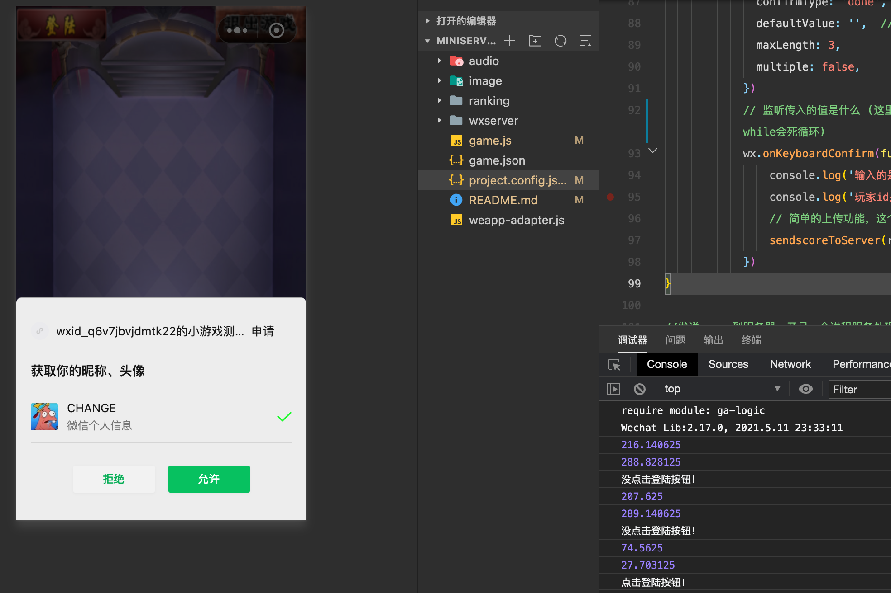
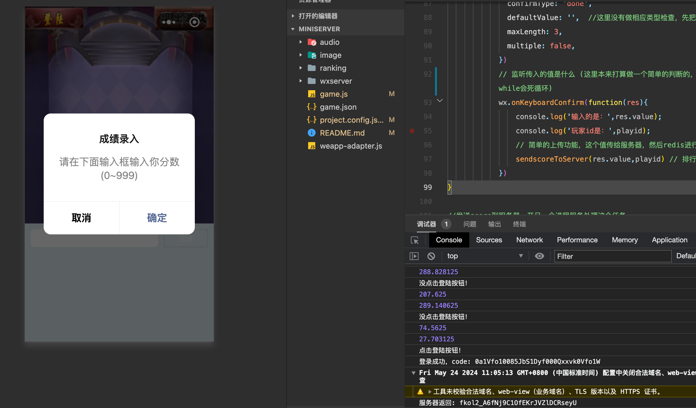
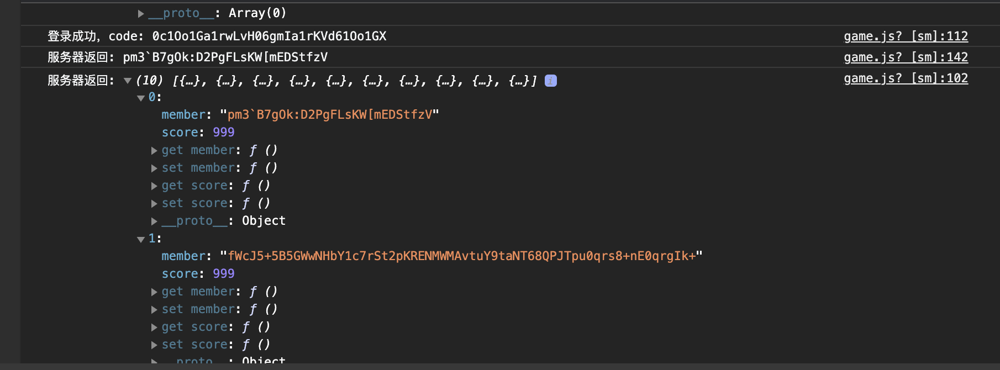
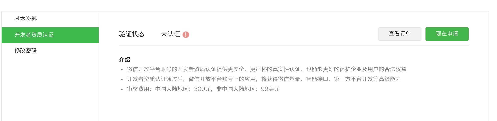

# miniserver

### 项目要求

结合微信登录, 设计一个玩家信息存储和排行榜储存的功能.

玩家信息要求:

1. 有支持微信登录的完整接口设计和流程
2. 玩家信息存在 Redis 上, 一般操作在 Redis, 10 分钟过期, 存储到 MongoDB 上. 再次上线的时候, 从 MongoDB 加载到 Redis 后, 继续在 Redis 上操作.

Player 信息有:

1. PlayerID
2. UnionID(来自微信)
3. OpenID(来自微信)

**排行榜**:基于 PlayerID 和客户端上传的 scores 数据, 存储在 Redis 上, 同样的分数, 要求按上报的时间排序, 先到的排在前面.

---------------

### 项目实现

项目分为客户端和服务端

* **客户端**：简单用户界面，实现用户点击 “登陆” 调用微信授权，然后进入主界面，主界面用户输入分数以便为后续排行榜提供数据支持

* **服务端**：

  （1）服务端首先根据客户端引导跳转微信授权后获取code

  （2）code通过http传递给服务端server，然后服务端根据code请求微信网页授权从而获取openid和session key 

  （3）使用sessionkey对用户私人信息encryptedData和iv进行解密，里面有unionid （这里需要微信开放平台认证绑定后才能获取，认证300rmb）

  （4）服务端server绑定8080端口在用户登陆之后，启动一个go程立即从mongdb的scores中取出玩家数据(playid 和 分数)加载到redis上。

  （5）用户在登录之后，向redis上插入玩家信息，并设置该键生存时间为10分钟，然后启动一个go协程对redis轮训查看哪些键要过期了，过期存入到mongdb中进行持久化存储（当生存时间设置的是几秒时测试通过成功持久化）

  （6）用户登陆成功之后，提醒输入分数，输入分数完毕之后，绑定8081端口的ranking服务将用户输入分数存入zset中，然后从大到小，分数相同时间先到的排前面，取出其中前10个（也可以取任意个），格式化处理成json返回给客户端，客户端可设置排行榜功能

--------------------

### 项目环境配置

* 其中redis(latest)和mongo(5 , 大于5版本的需要额外启动另一个与mongo交互的容器，因此这里选择5版本便于处理)均由docker拉取镜像启动容器后台运行并映射本地端口
* 微信小程序是申请了一个测试号，APPID为wx8cc47e6c7f4d0a7b 。这里在微信开发者工具里面运行客户端界面需要在本地配置里面把“不校验合法域名...”这个勾选上
* 其中在绑定本地8080端口的server服务中，redis绑定第1块db，mongo绑定名为 “ypw”数据库下的“ypw” collection
* 其中在绑定本地8081端口的ranking服务中，redis绑定第2块db，有名为“scores”的zset实现排行榜功能
* 其中server.go 和 ranking.go都需要外部的库，两者都配置好了go.mod ,根据go.mod进行拉取配置

配置好redis以及mongo之后，开两个终端分别进入到ranking和wxserver文件夹下，通过指令 “go run server.go” 和“go run ranking.go” 启动服务。接着用微信开发者工具打开客户端编译运行即可

--------------------------------------

### 项目效果

微信登陆实现

code获取以及openid获取

排行榜（手动插入了一些数据）

--------------

### 项目未实现功能

* 客户端对用户输入没有做判断限制，主要是因为onKeyboardConfirm这个接口异步，采用简单while会陷入循环，后来采用回调函数实现也有问题。

* 退出按钮和排行榜的客户端实现没做

* 针对用户playid的设置，采用的是对具有唯一性的openid进行+1简单加密的操作，应该在分布式全局环境下为用户唯一生成一个游戏id

* 针对unionid,只有在微信开发平台进行认证之后才能绑定从而才能获取unionid

  

-----------------

